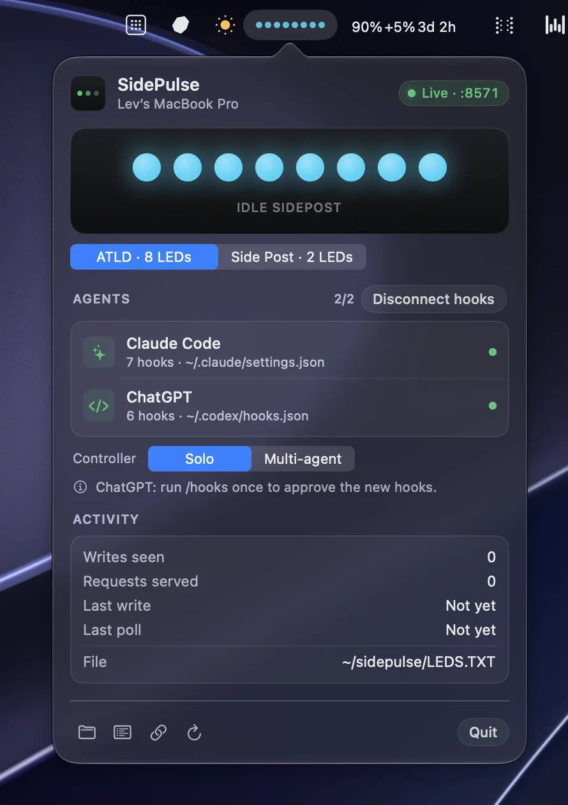
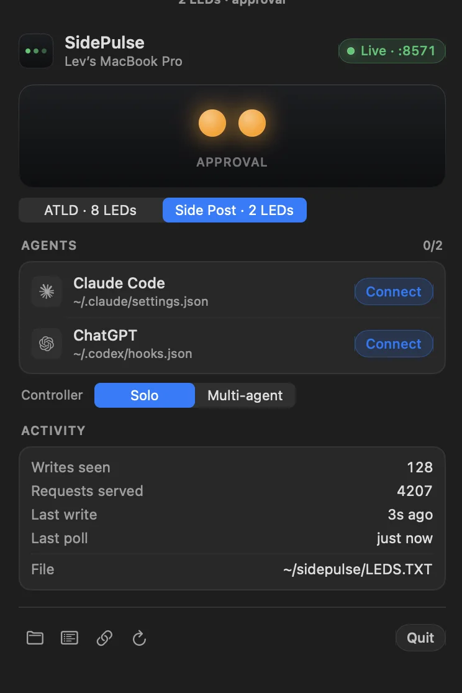

<div align="center">

# SidePulse

### See when Claude Code or ChatGPT needs you.

[](https://github.com/thatlev/SidePulse)
[](https://github.com/thatlev/SidePulse)
[](https://github.com/thatlev/SidePulse)
[](https://github.com/thatlev/SidePulse)
[](LICENSE)

[Install](#install) · [Connect agents](#connect-your-agents) · [Build for iPhone](#build-the-iphone-app) · [Docs](#documentation)

</div>


SidePulse turns coding-agent lifecycle events into a glanceable light. Its Mac
app shows the live status in your menu bar and serves the same LED program to
an iPhone over your local network. No account, cloud service, or subscription.

## Install

Paste one command into Terminal:

```sh
curl -fsSL https://thatlev.com/sidepulse.sh | sh
```

The script downloads the latest source, builds it locally, verifies the app,
installs it in `/Applications`, clears quarantine, and launches it. It requires
macOS 13 or newer and Xcode Command Line Tools.

To keep your own checkout:

```sh
git clone https://github.com/thatlev/SidePulse.git
cd SidePulse/macos/SidePulseMac
./build.sh --install --run
```

SidePulse has no Dock icon or main window. Look for its LED strip in the menu
bar and click it to open the control panel.

## Two display modes

| ATLD, 8 LEDs | Side Post, 2 LEDs |
|:---:|:---:|
|  |  |

Switch modes from the Mac panel or by tapping the iPhone app. Both modes use
the same status language:

| Light | Meaning |
|---|---|
| Moving green or cyan | Working |
| Solid orange | Waiting for approval |
| Solid green | Finished |
| Red double blink | Failed |

## Connect your agents

Open the menu bar panel and connect Claude Code and ChatGPT under **Agents**.
SidePulse adds only its own lifecycle hooks and leaves every unrelated hook
untouched. It never writes to `CLAUDE.md`, `AGENTS.md`, or your projects.

ChatGPT reviews newly added hooks once. Run `/hooks` in ChatGPT after connecting
and approve them.

The default **Solo** controller gives the whole strip to the latest active
project. If several agents are running, claim the strip from the project you
care about:

```sh
sidepulse-solo --claim
sidepulse-solo --who
sidepulse-solo --release
```

Choose **Multi-agent** in the panel when you prefer multiple project slots.

## Build the iPhone app

The iPhone app is source-only. Open the included Xcode project:

```sh
open ios/SidePulseSim/SidePulseSim.xcodeproj
```

In Xcode:

1. Select the SidePulse target.
2. Open **Signing & Capabilities** and choose your Apple team.
3. Select your iPhone as the run destination.
4. Press Run.

Keep the Mac and iPhone on the same Wi-Fi and allow Local Network access when
iOS asks. Bonjour discovery connects them automatically. A free Apple ID works
for personal-device builds.

For signing, discovery, and device troubleshooting, use the complete
[mobile setup guide](docs/MOBILE-SETUP.md).

## How it works

```text
Claude Code / ChatGPT lifecycle hooks
                 |
                 v
       ~/bin/sidepulse-solo
                 |
                 v
       ~/sidepulse/LEDS.TXT
                 |
          SidePulse.app
          /           \
  menu bar LEDs    local HTTP + Bonjour
                         |
                         v
                    iPhone app
```

The controller writes a tiny plain-text LED program. The native Mac app watches
that file, renders it in the menu bar, and serves it on port `8571`. The iPhone
discovers the Mac over Bonjour and polls only when the program changes.

The LED language is documented in [LEDS_FORMAT.txt](LEDS_FORMAT.txt). The Mac
and iPhone use the same parser and animation engine, so both displays agree.

## Useful commands

Preview states without waiting for an agent:

```sh
sidepulse working
sidepulse attention
sidepulse done
sidepulse off
```

Check the local server:

```sh
curl -s http://localhost:8571/health
```

Build only the Mac app:

```sh
cd macos/SidePulseMac
./build.sh
```

Remove the installed app, helpers, hooks, and runtime data:

```sh
./uninstall.sh --purge
```

## Documentation

- [iPhone setup and troubleshooting](docs/MOBILE-SETUP.md)
- [LED program format](LEDS_FORMAT.txt)
- [Mac app source](macos/SidePulseMac)
- [iPhone app source](ios/SidePulseSim)
- [Controller source](cli)
- [Fixture examples](fixtures)

## Development

Start with the repository test guide:

```sh
python3 tools/test_sidepulse_event.py
python3 tools/test_sidepulse_solo.py
```

The repository includes controller tests, parser and animation tests, hook
configuration tests, polling and recovery tests, installer tests, and a native
Mac preview harness. See [TEST.md](TEST.md) for the complete release checklist.

## Privacy

SidePulse stays on your devices. Agent hooks pass lifecycle metadata to local
helpers, the LED program is stored locally, and phone traffic stays on your
local network. There is no analytics service or SidePulse account.

## License

[MIT](LICENSE). Build it, change it, and make your own status light.
