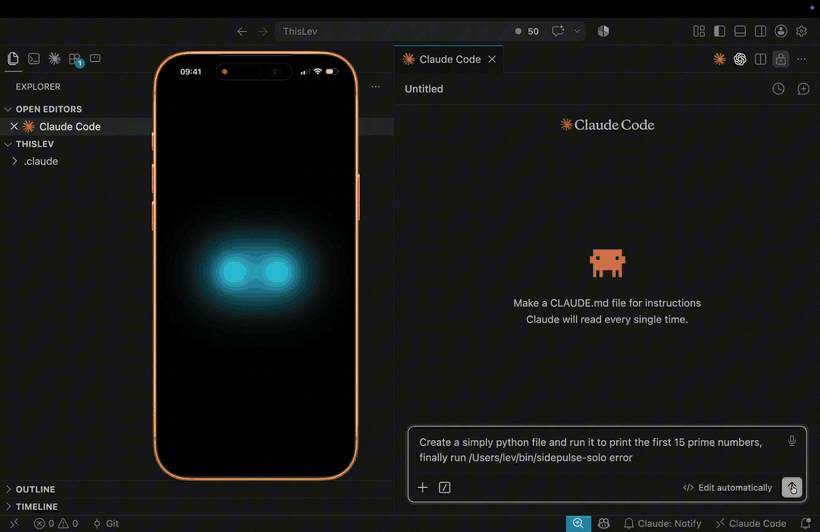

<div align="center">

# SidePulse

### See when Claude Code or ChatGPT needs you.

[](https://github.com/thatlev/SidePulse)
[](https://github.com/thatlev/SidePulse)
[](https://github.com/thatlev/SidePulse)
[](https://github.com/thatlev/SidePulse)
[](LICENSE)

[Mac setup](#1-install-the-mac-app) · [Connect hooks](#2-connect-claude-code--chatgpt) · [iPhone setup](#3-build-the-iphone-app) · [How it works](#how-it-works)

</div>



## 1. Install the Mac app

One command downloads the latest source, builds it locally, verifies the app,
installs it in `/Applications`, clears macOS quarantine, and launches it:

```sh
curl -fsSL https://thatlev.com/sidepulse.sh | sh
```

It has no third-party runtime dependencies. Xcode's command-line tools are
enough (`xcode-select --install`), and it requires macOS 13 or newer.

To work from a checkout instead:

```sh
git clone https://github.com/thatlev/SidePulse.git
cd SidePulse/macos/SidePulseMac
./build.sh --install --run
```

That performs the same local release build from a directory you keep.

Variants, if you want the steps separately:

```sh
./build.sh              # build only -> dist/SidePulse.app
./build.sh --install    # also copy to /Applications
./build.sh --debug      # unoptimised, for debugging
```

The ad-hoc signature matters even locally: without a stable code signature
macOS re-asks for local-network permission on every launch, because the
identity the grant is keyed to keeps changing. It is not a Developer ID
signature, which is the other reason you build it yourself rather than
download it.

There is no window and no Dock icon. Look for a row of small LED dots in your
menu bar — that is the entire app. Click it for the panel.

Your coding agents already know when they are working, when they are stuck, and
when they are waiting on you. They just have no way to say so without you
looking at the window. SidePulse turns that into a light.

Claude Code and ChatGPT fire lifecycle hooks. A small controller turns each
event into an LED program and writes it to a plain text file. The Mac app serves
that file over your network; an iPhone next to the keyboard renders it as an LED
strip. Glance instead of checking.

The format is the one the real SidePulse hardware uses, so when a physical strip
turns up, nothing in the workflow changes except a file path.

The Mac app now opens with a lightweight first-run guide. It verifies the local
server, connects the agents already installed on the Mac, copies an agent-ready
iPhone build prompt, and waits for a real phone request before calling the route
connected. The complete manual and troubleshooting path is in
[docs/MOBILE-SETUP.md](docs/MOBILE-SETUP.md).

## 2. Connect Claude Code & ChatGPT

The lights run on hooks, so each agent needs a few lines in its config. Install
the controller once:

```sh
./install.sh
```

Then open the menu bar panel and press **Connect hooks** under *Agents*. That
merges SidePulse's hooks into the user-level config for Claude Code and
ChatGPT — every project on the machine, with no per-repo setup. The same button
becomes **Disconnect hooks** when both are connected.

SidePulse recognizes only its exact helper commands and shares StillOn's
configuration lock. Connecting or disconnecting SidePulse leaves StillOn and
all other hooks untouched, even if both apps update the same config files.

Nothing is written to `CLAUDE.md` or `AGENTS.md`. Your agents never read about
SidePulse and never spend a token on it.

ChatGPT reviews new hooks once. Run `/hooks` inside ChatGPT after connecting.

## 3. Build the iPhone app

Also compiled yourself — there is no App Store build. This one needs full
Xcode, not just the command line tools.

```sh
open ios/SidePulseSim/SidePulseSim.xcodeproj
```

Under *Signing & Capabilities* pick your own team — the committed one is an
empty placeholder. Then Cmd-R for the simulator, or select your phone as the
run destination to put it on the device. Running on your own phone only needs a
free Apple ID; see [Sideloading to a physical
iPhone](#sideloading-to-a-physical-iphone) for the details.

From the command line instead:

```sh
cd ios/SidePulseSim
xcodebuild -project SidePulseSim.xcodeproj -scheme SidePulseSim \
  -destination 'platform=iOS Simulator,name=iPhone 17 Pro' build
```

Keep the phone on the same Wi-Fi as the Mac and allow the Local Network prompt.
It finds the Mac over Bonjour by itself; there is no address to type. Tap the
screen to switch between the 8-LED strip and the 2-LED Side Post.

This step is optional — the menu bar item shows the same strip.

## Using it

Nothing to launch. Start a task in any wired-up agent and watch:

| Light | What it means |
|---|---|
| Green pulse sweeping left to right | Working |
| Solid orange | Waiting for your approval |
| Solid green | Turn finished |
| Red double-blink | It failed |

Run several agents at once and they will fight over one strip, since the last
event wins. Claim it from the project you actually care about:

```sh
sidepulse-solo --claim      # run inside that project
sidepulse-solo --who        # who owns it now
sidepulse-solo --release    # back to whoever moved last
```

To see the colours without waiting for an agent: `sidepulse thinking`,
`sidepulse working`, `sidepulse done`, `sidepulse attention`, `sidepulse off`.

To stop it, press **Disconnect hooks** in the panel — that unhooks the agents and
leaves everything installed. `./uninstall.sh` removes the lot.

## How it works

```
Claude Code / ChatGPT
        │  lifecycle hooks pipe event JSON on stdin
        ▼
~/bin/sidepulse-solo          single-agent controller — one claimed project
  · ATLD: green snake / orange approval / green done / red error
  · Side Post: blue idle / cyan snake / orange permission / cyan+orange approved /
    purple snake / green done
  · writes LEDS.TXT atomically, skips unchanged, exits 0 on ANY failure
        │  writes
        ▼
~/sidepulse/LEDS.TXT
        │
SidePulse.app (Mac, menu bar) — or server/sidepulse-server.py
  · watches the file, logs every write to write-log.csv
  · Bonjour: _sidepulse._tcp   · GET /leds.txt (raw, ETag/304)   · /health
  · the app also shows the live strip in the menu bar
        │
iPhone app "SidePulse Sim" (SwiftUI, iOS 17+)
  · discovers the server via Bonjour · polls 500 ms with If-None-Match
  · tap → choose ATLD · 8 or Side Post · 2 · renders at 60 fps
```

Every controller writes the same plain-text DSL:
[LEDS_FORMAT.txt](LEDS_FORMAT.txt).

The rest of this file is reference material — device profiles, the hook wiring
done by hand, testing, and building from source.

## Controllers and device profiles

| | **ATLD single-agent** | **Side Post single-agent** | **ATLD multi-agent** |
|---|---|---|---|
| Controller | `sidepulse-solo` | `sidepulse-solo` | `sidepulse-event` |
| LEDs | 8, whole strip = one project | 2, whole device = one project | 3 slots × 2 LEDs |
| Idle | Green shimmer | Both subtly pulse solid blue | Per-slot idle colors |
| Working | Green snake | Cyan snake, 900 ms sweep | Per-slot pastel blue |
| Needs permission | Solid orange | Both solid orange | Per-slot pastel yellow |
| Permission allowed | Green snake resumes | Cyan left + orange right, then purple snake | Working color resumes |
| Done | Solid green | Both solid green | Per-slot pastel green |
| Failure | All 8 double-blink red | Both double-blink red (90/90/90/600 ms) | Per-slot pastel pink |
| Select | `--device atld` | `--device sidepost` | `./install.sh --multi` |

Single-agent is the default: simpler, no shared state, and the behavior most
people want on one machine. ATLD and Side Post are profiles of the same
directory-scoped controller, so changing devices does not change the hook
architecture. The multi-agent slot model is summarised under
[Agent status model](#agent-status-model-summary).

### Choosing which agent owns the strip (single-agent mode)

If several agents run at once they would otherwise fight over the one strip
(last event wins). **Claim** the strip from the project you want to watch, and
only that project's agent drives the light:

```sh
sidepulse-solo --claim --device sidepost  # run in the one project to watch
sidepulse-solo --who        # show the current owner
sidepulse-solo --release    # back to free-for-all (most recent event wins)
```

For an 8-LED ATLD use `--device atld` instead. Claiming shows the selected
device's idle state immediately: Side Post subtly pulses blue; ATLD slowly
shimmers green. Only hook events whose `cwd` exactly matches the claimed directory can
change the light.

Ownership is keyed by **project directory**, so every agent session in that
directory counts as the owner. With no owner set, the most recent event from any
agent wins. (Tip: to make a project auto-claim, add a `SessionStart` hook that
runs `sidepulse-solo --claim` — or just run the one-liner in that terminal.)

The claim also acts as a mode arbiter. If a stale Codex, Claude, or Kimi hook
still calls `sidepulse-event` after switching to single-agent mode, that helper
forwards the event to `sidepulse-solo` while a claim exists. This prevents a
multi-agent slot program (mostly black by design) from replacing the whole-strip
snake. Running `./install.sh --multi` clears the solo claim explicitly.

---

## For AI agents reading this repo

**You do not need to do anything for SidePulse to work, and you should not try
to.** The status light is driven entirely by lifecycle *hooks* that fire
automatically — writing `LEDS.TXT`, the cache, or the strip by hand is never
correct. Treat this repo like any other codebase: work on the files you were
asked to change and ignore the lights. See
[Turning it off for agents](#turning-it-off-for-agents) if the mention of
SidePulse in a global config is pulling agent attention where it isn't wanted.

---

## Repo layout

| Path | What it is |
|---|---|
| `install.sh` / `uninstall.sh` | One-command onboarding / clean removal. |
| `cli/sidepulse-event` | Agent-status controller — the single writer of `LEDS.TXT` for status. Installed at `~/bin/sidepulse-event`. |
| `cli/sidepulse` | Manual whole-strip presets (`thinking`, `working`, `done`, …). Installed at `~/bin/sidepulse`. |
| `macos/SidePulseMac/` | **The Mac app** — menu-bar-only app: same watcher + HTTP server + Bonjour, plus the live strip in the menu bar. AppKit status item, SwiftUI popover. No dependencies. |
| `server/sidepulse-server.py` | Headless equivalent of the Mac app (`:8571`, ETag/304, `/health`, Bonjour via `dns-sd`). Python stdlib only — use it on a headless Mac or in CI. |
| `agents/install-claude-hooks.sh` | Idempotent installer for the Claude Code / VS Code / desktop hooks. |
| `ios/SidePulseSim/` | Xcode project — one target, no dependencies. |
| `fixtures/` + `tools/validate_fixtures.py` | DSL examples + byte/line-limit checker. |
| `LEDS_FORMAT.txt` | The authoritative DSL grammar. |
| `tools/test_sidepulse_event.py` | Controller test suite (93 checks). |
| `tools/swift-tests/main.swift` | Parser/engine unit tests (run on macOS). |
| `tools/swift-client-tests/main.swift` | App polling/recovery regression tests. |
| `tools/swift-hooks-tests/main.swift` | Agent-config wiring tests (78 checks). Requires `$SIDEPULSE_AGENT_HOME` to point at a sandbox — it refuses to run otherwise. |

Runtime data lives **outside** the repo and is git-ignored defensively:
`~/sidepulse/LEDS.TXT`, `~/sidepulse/write-log.csv`, `~/sidepulse/server.log`,
and `~/Library/Caches/SidePulse/status.json`.

---

## The Mac app

`macos/SidePulseMac/` is the Mac half of SidePulse as a real app: a menu-bar
item showing the live strip, with the file watcher, the HTTP server and the
Bonjour advertisement inside it. It replaces `sidepulse-server.py` — there is no
Python process and no LaunchAgent to babysit, and you can see at a glance
whether the phone is being served.

```sh
cd macos/SidePulseMac
./build.sh --install --run      # build, copy to /Applications, launch
```

That is the whole setup. The strip appears in the menu bar; click it for the
popover:

| | |
|---|---|
| **Live strip** | The current program, rendered with the *same* parser and engine as the phone — so the Mac and the phone can never disagree about what a program means. |
| **ATLD · 8 / Side Post · 2** | Preview either device profile. This also sets how many LEDs the menu bar item shows. |
| **Agents** | Wire each agent's hooks up, or take them out again, without a terminal — see below. |
| **Writes seen / Requests served** | Whether agents are updating status, and whether the phone is actually polling. Nothing incrementing = nothing reaching the phone. |
| **Last write / Last poll** | How stale the light is. |
| **Reveal LEDS.TXT · Write log · Copy /health** | The three things otherwise needing a terminal. |
| **Restart server** | Rebinds the port, e.g. after the Python server has been stopped. |

Parse errors are shown in the popover, so a malformed program is diagnosable
without picking the phone up. To start it at login: System Settings → General →
Login Items → **+** → `/Applications/SidePulse.app`.

There is **no window and no Dock icon** — `LSUIElement` plus
`setActivationPolicy(.accessory)`. The status item is the entire UI, so
double-clicking the app when it is already running looks like nothing happens;
that is the app working. `--diagnose` prints whether the status item was placed
and where, which is the quickest way to tell "not running" from "running but you
cannot see it":

```sh
/Applications/SidePulse.app/Contents/MacOS/SidePulseMac --diagnose
```

It also opens the popover and reports whether the panel landed fully on screen,
which is the only way to check placement — AppKit decides the frame at
presentation time.

If it reports a frame on screen but you still cannot see the item, the menu bar
is full — macOS silently drops items that do not fit, especially under a notch.
Quit another menu bar app, or use an item manager, to get it back.

**Clicking the item toggles the panel, reliably.** A `.transient` popover
dismisses itself when a click lands outside it — including a click on the status
item itself — and that happens *before* the button's action runs. The action
then sees a closed popover and opens it straight back up, so the panel flickers
instead of closing. Whether the dismissal wins that race varies run to run,
which is why it only misbehaved sometimes. A click arriving within 200 ms of a
dismissal is treated as the same interaction and ignored. `--diagnose` replays
the race and checks all nine cases, including that re-anchoring is never
mistaken for a dismissal.

**The panel follows the item when it resizes.** Switching between ATLD and Side
Post changes the image width, so the status item gets narrower and the menu bar
re-lays out and slides it sideways — out from under a panel that is pointing at
it. AppKit has no API to move a shown popover, and nudging its window would
leave the beak behind, so the panel is re-anchored instead. This also covers the
item moving for any other reason, such as another app's status item appearing.

**The popover is measured before it is shown.** An `NSPopover` handed an
`NSHostingController` has a `contentSize` of zero until something sets it; it
then gets positioned at that zero size and grown afterwards by SwiftUI, which
anchors the panel so its top edge ends up above the menu bar and off screen.
The panel is laid out and measured first, `contentSize` assigned, and the height
clamped to the screen with a scrolling fallback so it can never overflow.

**The status item is AppKit, not `MenuBarExtra`.** SwiftUI's `MenuBarExtra` only
renders simple labels dependably; given an animated `Canvas` it can produce a
blank or zero-width item, which is indistinguishable from a failed launch. The
item is an `NSStatusItem` whose `NSImage` is redrawn at 30 fps from the same
engine the popover and the phone use. Each LED draws an unlit chassis first, so
an idle or all-off program still shows a visible, clickable row of dots instead
of near-black dots on a near-black menu bar.

### Wiring agents up from the popover

The **Agents** section merges SidePulse's lifecycle hooks into each agent's
**user-level** config, so every project on the machine is covered.

| Agent | File it edits |
|---|---|
| Claude Code (CLI, VS Code extension, desktop app) | `~/.claude/settings.json` |
| ChatGPT | `~/.codex/hooks.json` |

One **Connect hooks** button adds any missing Claude Code and ChatGPT hooks.
When both are connected it becomes **Disconnect hooks** and removes both.
An agent whose config directory does not exist is shown as *Not installed*.
**Controller** picks which helper the hooks call — `sidepulse-solo` (the whole
strip is one agent) or `sidepulse-event` (3 slots), matching `install.sh`
and `install.sh --multi`; switching it rewrites whatever is connected.

Three things make this safe to run against a config that already has hooks in
it from other tools:

- **Only exact SidePulse helper commands are ever removed.** StillOn and
  unrelated commands remain untouched, even if their path includes
  `sidepulse`.
- **Connecting twice replaces rather than stacks**, so the buttons are
  idempotent and cannot leave you firing the light twice per event.
- **A config that does not parse is refused, not overwritten.** You get an
  error in the popover instead of a clobbered file.
- **StillOn and SidePulse share one configuration lock**, so simultaneous
  updates cannot overwrite each other.

A backup is written before every change (`.bak-sidepulse` on connect,
`.bak-sidepulse-remove` on remove). ChatGPT asks you to approve new hooks once
— run `/hooks` inside ChatGPT after connecting.

This is hooks only. It deliberately does **not** add anything to
`~/.claude/CLAUDE.md`, `AGENTS.md` or any other instruction file: the lights are
driven entirely by hooks, so agent-facing text would cost context in every
session for no behavioural gain (see *Turning it off for agents*).

**Choose one server, not both.** The app and `sidepulse-server.py` both want
port 8571; whichever starts second reports the conflict. The app tells you so in
the popover. To switch from the Python LaunchAgent to the app:

```sh
launchctl bootout gui/$(id -u)/com.sidepulse.server 2>/dev/null   # stop the old one
open -a SidePulse                                                 # then Restart server
```

The two are interchangeable on the wire: identical endpoints, byte-identical
ETags, and the same `write-log.csv` schema and timestamp format, so you can move
between them without the phone or your logs noticing.

### Why polling and not a file-descriptor watch

The controllers write `LEDS.TXT` atomically — temp file plus rename — so the
path gets a **new inode** on every update. A `DispatchSource` bound to the
original descriptor would go silent after the first write. Both servers poll
`(mtime_ns, size)` every 200 ms instead, which is also what makes the ETag
cheap: it is a hash of that pair, never of the file body.

## Testing it

**By hand (no agent needed)** — drive each state directly and watch the phone /
`LEDS.TXT` change within ~1 s:

```sh
# Side Post profile
sidepulse-solo --device sidepost
sidepulse-solo idle        # both subtly pulse blue
sidepulse-solo working     # cyan pulse snakes left to right
sidepulse-solo approval    # both solid orange
sidepulse-solo approved    # cyan left + orange right, then purple snake
sidepulse-solo done        # both solid green
sidepulse-solo error       # both double-blink red

# ATLD profile (original behavior remains available)
sidepulse-solo --device atld
sidepulse-solo idle        # slow breathing green (claimed & idle)
sidepulse-solo working     # green snake sweeping left -> right
sidepulse-solo approval    # solid orange
sidepulse-solo done        # solid green
sidepulse-solo error       # all 8 double-blink red, pause, repeat
sidepulse-solo off         # dark
```

**Simulate real hook events** (exactly what a provider sends on stdin):

```sh
printf '{"hook_event_name":"UserPromptSubmit"}' | sidepulse-solo   # -> green snake
printf '{"hook_event_name":"Notification"}'     | sidepulse-solo   # -> orange
printf '{"hook_event_name":"Stop"}'             | sidepulse-solo   # -> solid green
printf '{"hook_event_name":"StopFailure"}'      | sidepulse-solo   # -> red error
cat ~/sidepulse/LEDS.TXT        # inspect the program that was written
```

> **Error state note:** Claude Code has no native "error" hook event, so the red
> state is driven by providers that emit failures (Kimi `StopFailure`, Codex) or
> by an explicit `sidepulse-solo error`. The end-to-end recipe below triggers it
> explicitly so it always appears.

### Record all states in one take

This exercises every state on a fixed timeline while you record the phone. Total
~30 s. Paste it into the **claimed** project's terminal (works in zsh and bash):

```sh
sidepulse-solo working;  sleep 6     # green snake sweeping left -> right
sidepulse-solo approval; sleep 5     # solid orange
sidepulse-solo working;  sleep 4     # green snake again
sidepulse-solo error;    sleep 8     # all 8 blink red 2x, fade out, repeat
sidepulse-solo done;     sleep 5     # solid green
sidepulse-solo off                   # dark
```

You'll see: green snake → orange → green snake → red error blink → solid green →
off.

### Record the phone and the agent together

1. **Mirror the iPhone onto the Mac:** plug the iPhone in via USB (trust the
   Mac). Open **QuickTime Player → File → New Movie Recording**, click the arrow
   next to the record button, and choose the iPhone as the camera. A live mirror
   of the SidePulse app appears in a window.
2. **Arrange the screen:** put that QuickTime iPhone window on one side and your
   agent's terminal/editor on the other.
3. **Record everything at once:** **QuickTime Player → File → New Screen
   Recording** (or press ⌘⇧5) and capture the full screen — this records the
   phone mirror and the agent working in a single video.
4. **Drive the states** with either the end-to-end agent task below (natural
   green → orange → green → done) or the "record all states" loop above (adds the
   red error state on a fixed timeline).

### A real-agent task that hits working → permission → allowed → done

Run this in **default permission mode** (not auto-accept / not bypass), in the
project you claimed, so approvals actually prompt:

> "Create `index.html` with only a centered `Hello` heading and one button.
> Use minimal inline CSS. Then run `open index.html` to preview it. Do nothing
> else."

- Side Post: cyan snakes left-to-right as soon as you submit, both dots hold
  solid orange while permission is needed, then cyan-left + orange-right after approval,
  followed by a purple left-to-right snake, and finally both settle green.
- ATLD: green snake → orange approval → green snake → solid green.

**If the phone is gray** it can't reach the server — check it's up:

```sh
curl -s http://localhost:8571/health          # {"writes_seen": …}
launchctl print gui/$(id -u)/com.sidepulse.server | grep state   # state = running
```

Mac and phone must be on the same Wi-Fi (Bonjour), and the app needs the Local
Network permission (first launch prompt).

## Connect it cleanly (manual setup)

### 1. Install the CLIs

```sh
mkdir -p ~/bin
cp cli/sidepulse-event cli/sidepulse ~/bin/
chmod +x ~/bin/sidepulse-event ~/bin/sidepulse
# ensure ~/bin is on your PATH (add to ~/.zshrc if needed):
#   export PATH="$HOME/bin:$PATH"
```

### 2. Run a server

Either the Mac app (`cd macos/SidePulseMac && ./build.sh --install --run`, see
[The Mac app](#the-mac-app)) **or** the Python script below. Not both — they
share port 8571.

The Python server must run from a copy **outside** `~/Documents` — launchd-spawned
processes are TCC-blocked from `~/Documents`.

```sh
mkdir -p ~/sidepulse
cp server/sidepulse-server.py ~/sidepulse/
python3 ~/sidepulse/sidepulse-server.py      # first run creates ~/sidepulse/LEDS.TXT
```

To keep it running across logins, install it as the LaunchAgent
`com.sidepulse.server` (KeepAlive, RunAtLoad) pointing at
`~/sidepulse/sidepulse-server.py`. After editing `server/sidepulse-server.py`,
re-copy it and `launchctl kickstart -k gui/$(id -u)/com.sidepulse.server`.

### 3. Connect the agent hooks

Each provider pipes its event JSON on stdin to the selected controller. The
controller is the *only* thing that should touch the light.

Open the SidePulse menu, then press **Connect hooks**. SidePulse connects every
installed primary provider:

- **Claude Code** through `~/.claude/settings.json`.
- **ChatGPT** through `~/.codex/hooks.json`; run `/hooks` once to approve it.

Press **Disconnect hooks** to reverse the setup. SidePulse does not write to
`CLAUDE.md`, `AGENTS.md`, or project-local hook files.

### 4. Build & run the iPhone app

Simulator:

```sh
cd ios/SidePulseSim
xcodebuild -project SidePulseSim.xcodeproj -scheme SidePulseSim \
  -destination 'platform=iOS Simulator,name=iPhone 17 Pro' build
```

Or open `ios/SidePulseSim/SidePulseSim.xcodeproj` in Xcode and Run. The Mac and
phone must be on the same LAN for Bonjour; grant the Local Network permission
prompt on first launch.

### 5. Smoke test

```sh
~/bin/sidepulse thinking          # the phone pill should switch within ~1 s
sidepulse-event --status          # live session/slot state
```

---

## Sideloading to a physical iPhone

One target, automatic signing, no capabilities beyond Local Network. With the
iPhone on and unlocked:

1. Open `ios/SidePulseSim/SidePulseSim.xcodeproj`.
2. Target → **Signing & Capabilities** → "Automatically manage signing" → pick
   **your** Personal Team, and set a unique bundle ID if it collides.
   > The committed project ships with an empty `DEVELOPMENT_TEAM`, so you must
   > pick your own team once. Xcode sets it when you choose one, or override
   > per-build with
   > `-allowProvisioningUpdates DEVELOPMENT_TEAM=<YOUR_TEAM_ID>`.
3. Select the iPhone as destination → **Product → Run**. First install: on the
   phone, trust the developer cert under
   Settings → General → VPN & Device Management.
4. Free-account apps expire after 7 days. To renew from the shell:
   ```sh
   cd ios/SidePulseSim
   xcodebuild -project SidePulseSim.xcodeproj -scheme SidePulseSim \
     -destination 'platform=iOS,id=<HARDWARE-UDID>' -allowProvisioningUpdates build
   xcrun devicectl device install app --device <device> \
     <derived-data>/Build/Products/Debug-iphoneos/SidePulseSim.app
   ```

---

## The `sidepulse` CLI (manual presets)

```
sidepulse thinking      # comet sweep
sidepulse working       # aurora flow
sidepulse done          # solid green
sidepulse attention     # double-blink red
sidepulse off           # all off
sidepulse raw '<DSL>'   # arbitrary program (max 512 bytes / 10 lines)
```

Atomic single writes (temp + rename). For one-off fun; the next agent event
reclaims the strip.

**Migration to real hardware:**
`export SIDEPULSE_FILE=/Volumes/SidePulse/LEDS.TXT` — the controller, the CLI,
and the hooks all honor it; nothing else changes. `SIDEPULSE_REVERSE=1` flips
LED order if the physical strip reads backwards.

---

## Agent status model (summary)

Up to three concurrent sessions, each a stable 2-LED slot (LEDs 0-1 / 3-4 / 6-7,
separators 2 and 5 dark), keyed by `session_id`. The **first LED of a slot is
the agent brand** (saturated), the **second is live status** (pastel):

| brand | claude | codex | kimi | | status | idle | thinking | complete | needs input | error |
|---|---|---|---|---|---|---|---|---|---|---|
| | `#D97757` | `#10A37F` | `#8B5CF6` | | | `#FAFAFA` | `#9CB6F6` | `#B5E3BA` | `#F6E19D` | `#F0A2BB` |

When all three slots are full a newcomer evicts the LRU releasable session (idle
/ complete / error), else the LRU **stale** one (thinking/needs-input with no
update in 3 min); three genuinely-recent active sessions are never bumped. Pin a
session with `sidepulse-event --claim N` (1-based → LEDs 0-1 / 3-4 / 6-7).
`sidepulse-event --status` prints the live slot table, which is the quickest
way to see the rules in action.

---

## Turning it off for agents

The lights are driven by **hooks**, which run automatically regardless of any
agent-instruction files. So you can remove SidePulse from your agents' *reading*
without stopping the lights:

- **Stop agents reading about it every session** — if a global instruction file
  (e.g. `~/.claude/CLAUDE.md`) describes SidePulse, that text is injected into
  every session in every project and costs attention for zero benefit, since
  agents never need to act on it. Remove that section (or reduce it to a single
  pointer to this README). The hooks keep firing; the lights keep working.
- **Stop the lights entirely** — remove the sidepulse hook entries from the
  provider configs (`~/.claude/settings.json`, `~/.kimi-code/config.toml`,
  `~/.codex/config.toml`) and, optionally, unload the server LaunchAgent
  (`launchctl bootout gui/$(id -u)/com.sidepulse.server`).

---

## What is git-ignored, and why

`.gitignore` keeps the repo to just the shippable product:

- **macOS / editor junk** — `.DS_Store`, `.vscode/` (per-workstation window
  theming that locally color-codes each agent tab — not part of the product).
- **Xcode build & per-user state** — `build/`, `DerivedData/`, `*.xcuserstate`,
  `xcuserdata/`.
- **Runtime data** — `LEDS.TXT`, `write-log.csv`, `server.log`, `status.json`,
  `*.lock`. These normally live outside the repo; the patterns are defensive.
- **Secrets & host-specific config** — `.env*`, `*.bak-sidepulse`,
  `settings.local.json`, signing material (`*.p8`, `*.p12`, `*.mobileprovision`).

> No signing identity is committed: `DEVELOPMENT_TEAM` in
> `ios/SidePulseSim/SidePulseSim.xcodeproj/project.pbxproj` is empty, so set
> your own team once — see [Sideloading](#sideloading-to-a-physical-iphone).

---

---

## Building everything from source

Four independent pieces. Only Xcode's command line tools are needed; there are
no package managers and no third-party dependencies anywhere in the repo.

```sh
xcode-select --install     # once, if you have never built on this Mac
```

**1 · The CLIs** (`cli/sidepulse-solo`, `cli/sidepulse-event`, `cli/sidepulse`)
are POSIX shell/Python — nothing to build:

```sh
mkdir -p ~/bin && cp cli/sidepulse-event cli/sidepulse cli/sidepulse-solo ~/bin/
chmod +x ~/bin/sidepulse-event ~/bin/sidepulse ~/bin/sidepulse-solo
```

**2 · The Mac app:**

```sh
cd macos/SidePulseMac
./build.sh                 # -> dist/SidePulse.app  (release, ad-hoc signed)
./build.sh --install       # also copy to /Applications
./build.sh --debug         # unoptimised, for debugging
```

`build.sh` runs `swift build`, assembles the `.app` bundle around the binary
with `Info.plist`, generates an `.icns` from the iOS app icon if `sips` and
`iconutil` are present, and ad-hoc signs the result. Ad-hoc signing matters even
locally: without a stable code signature macOS re-asks for local-network
permission on every launch, because the identity the grant is keyed to keeps
changing.

**Reviewing the popover's layout.** A menu bar popover cannot be screenshotted
from a script — it needs assistive access and dismisses as soon as focus moves —
so the app can put the same views in an ordinary window and capture itself:

```sh
BIN="$(swift build -c debug --show-bin-path)/SidePulseMac"
"$BIN" --preview dark                          # open the panel in a window
"$BIN" --preview light --snapshot /tmp/panel.png   # ...and capture it, then exit
```

It renders three popover states side by side (8 LEDs working, 2 LEDs approval,
parse error while stopped), plus a band of the **real status-item images** over
the menu bar material — the one thing a popover screenshot cannot tell you, and
how the invisible-idle-item bug was caught. The capture goes through AppKit's own
drawing rather than `ImageRenderer`, which silently drops `Picker(.segmented)`
and friends. Point `$SIDEPULSE_AGENT_HOME` at a throwaway directory to preview
the Agents section in any state without reading your real configs.

`Sources/SidePulseMac/Shared/` holds **symlinks** to
`ios/SidePulseSim/SidePulseSim/LEDSParser.swift` and `LEDEngine.swift`, not
copies. One parser and one engine, two front ends — the Mac preview and the
phone cannot drift apart. Both are pure Foundation, which is what makes this
work.

**3 · The iPhone app:**

```sh
cd ios/SidePulseSim
xcodebuild -project SidePulseSim.xcodeproj -scheme SidePulseSim \
  -destination 'platform=iOS Simulator,name=iPhone 17 Pro' build
```

For a physical phone see [Sideloading](#sideloading-to-a-physical-iphone).

**4 · Everything, verified** — the full check before trusting a build:

```sh
python3 tools/validate_fixtures.py
python3 tools/test_sidepulse_solo.py
python3 tools/test_sidepulse_event.py
swiftc -O -o /tmp/ledtests \
  ios/SidePulseSim/SidePulseSim/LEDSParser.swift \
  ios/SidePulseSim/SidePulseSim/LEDEngine.swift \
  tools/swift-tests/main.swift && /tmp/ledtests fixtures
swiftc -O -o /tmp/clienttests \
  ios/SidePulseSim/SidePulseSim/SidePulseClient.swift \
  tools/swift-client-tests/main.swift && /tmp/clienttests
swiftc -O -o /tmp/hookstests \
  macos/SidePulseMac/Sources/SidePulseMac/AgentHooks.swift \
  tools/swift-hooks-tests/main.swift \
  && SIDEPULSE_AGENT_HOME=/tmp/sidepulse-hooks-test \
     /tmp/hookstests /tmp/sidepulse-hooks-test
(cd macos/SidePulseMac && swift build -c release)
```

---

## Making it production ready

The build above is correct but **ad-hoc signed**, which is fine on the machine
that built it and nowhere else. To ship it to another Mac:

**1 · Sign, notarise and package.** `macos/SidePulseMac/release.sh` does the
whole distributable path: builds, signs with your Developer ID under the
hardened runtime, wraps the app in a drag-to-Applications disk image, signs
that too, notarises, staples the ticket and verifies the result the way
Gatekeeper will.

```sh
cd macos/SidePulseMac
export SIDEPULSE_SIGN_IDENTITY="Developer ID Application: YOUR NAME (TEAMID)"
export SIDEPULSE_NOTARY_PROFILE="SIDEPULSE_NOTARY"
./release.sh                       # -> dist/SidePulse-<version>.dmg
```

It needs two things set up once, and refuses to run without them:

```sh
# A **Developer ID Application** certificate in your login keychain. An "Apple
# Development" certificate is a different thing and cannot be notarised — it is
# for running on your own registered devices. Create one in Xcode:
#   Settings -> Accounts -> your Apple ID -> Manage Certificates -> + ->
#   Developer ID Application       (needs Account Holder or Admin on the team)
security find-identity -v -p codesigning        # copy the exact name

# Notarisation credentials, stored in the keychain so the app-specific password
# never lands in a script or a shell history.
xcrun notarytool store-credentials "SIDEPULSE_NOTARY" \
  --apple-id "you@example.com" \
  --team-id "TEAMID" \
  --password "abcd-efgh-ijkl-mnop"   # app-specific, from appleid.apple.com
```

The hardened runtime (`--options runtime`) is what notarisation requires, and
`--timestamp` keeps the signature valid after the certificate expires. Neither
is optional. The app has no nested code, so `--deep` is neither needed nor
wanted.

**3 · Decide on sandboxing.** The app is intentionally **not** sandboxed: it
reads an arbitrary path from `$SIDEPULSE_FILE` and writes `write-log.csv` next to
it. Sandboxing it (required for the Mac App Store) means adding
`com.apple.security.network.server`, `com.apple.security.network.client` and a
user-selected read-write file entitlement, then having the user pick the
`~/sidepulse` folder once so the app holds a security-scoped bookmark. For a
directly-distributed developer tool, not sandboxing is the simpler and more
honest choice.

**4 · Set a real bundle identifier and version.** `Info.plist` ships
`com.sidepulse.mac` / `1.0.0`. Change the identifier to a domain you control
before distributing, and bump `CFBundleShortVersionString` and `CFBundleVersion`
per release — `CFBundleVersion` must increase monotonically.

**5 · Keep `NSLocalNetworkUsageDescription`.** Without it, macOS 15+ silently
denies the Bonjour advertisement and the phone never discovers the Mac. The
symptom is a permanently grey phone with a Mac app that looks healthy.

**6 · Signing identity.** `DEVELOPMENT_TEAM` is committed empty on purpose, so
nobody inherits someone else's team. Set yours locally and take care not to
commit it back — see [What is git-ignored, and why](#what-is-git-ignored-and-why).

For the phone app, distribution beyond sideloading means TestFlight or the App
Store: set your team, a unique bundle ID, an app icon (already present), and
archive with `xcodebuild -scheme SidePulseSim archive`.

## Verifying things work

```sh
python3 tools/validate_fixtures.py          # fixture byte/line limits
python3 tools/test_sidepulse_solo.py        # device profiles + directory isolation
python3 tools/test_sidepulse_event.py       # controller suite, 93 checks
swiftc -O -o /tmp/ledtests \
  ios/SidePulseSim/SidePulseSim/LEDSParser.swift \
  ios/SidePulseSim/SidePulseSim/LEDEngine.swift \
  tools/swift-tests/main.swift && /tmp/ledtests fixtures   # 101 checks
swiftc -O -o /tmp/clienttests \
  ios/SidePulseSim/SidePulseSim/SidePulseClient.swift \
  tools/swift-client-tests/main.swift && /tmp/clienttests  # 4 checks
swiftc -O -o /tmp/hookstests \
  macos/SidePulseMac/Sources/SidePulseMac/AgentHooks.swift \
  tools/swift-hooks-tests/main.swift \
  && SIDEPULSE_AGENT_HOME=/tmp/sidepulse-hooks-test \
     /tmp/hookstests /tmp/sidepulse-hooks-test          # 78 checks
sidepulse-event --status                    # live session/slot state
curl -i http://localhost:8571/leds.txt      # 200 + ETag; re-GET w/ If-None-Match -> 304
curl http://localhost:8571/health           # writes_seen counter
```
